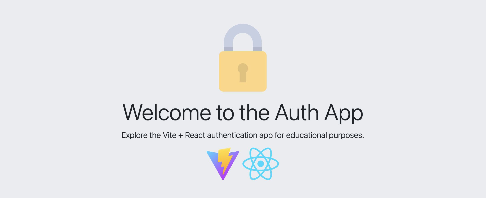

# OAuth Client with Vite & React

<p align="center">
  
</p>

<!-- CONTACTS -->
<div>
    <p align="center">
        <br />
        <a href="#about-project">About Project</a>
        ·
        <a href=mailto:"konstantin.priluchnyi@gmail.com?subject=report%20Bug">Report Bug</a>
        ·
        <a href=mailto:"konstantin.priluchnyi@gmail.com?subject=Request%20Feature">Request Feature</a>
    </p>
    <p align="center">
        <a href=mailto:"konstantin.priluchnyi@gmail.com">
            
        </a>
        <a href="https://t.me/konstantin_evo">
            
        </a>
        <a href="https://www.linkedin.com/in/konstantin-evo/">
            
        </a>
    </p>
</div>

## 1. About Project

This project is a small web application designed to demonstrate the OAuth 2.0 authorization code flow. It uses React for
the frontend and Vite for the build configuration.

## 2. Getting started

### 2.1. How to run

To run this project, follow these steps:

1. **Clone the repository:**
    ```bash
    git clone https://github.com/konstantin-evo/auth-with-vite-and-react.git
    cd ./auth-with-vite-and-react
    ```

2. **Install dependencies:**
    ```bash
    npm install
    ```

3. **Run the development server:**
    ```bash
    npm run dev
    ```
   The application will be available at `http://127.0.0.1:5173`.

**Note**: For running locally an OAuth server with the ability to manually create users, client application and so on
you can use the following repository: https://github.com/konstantin-evo/ory-hydra-with-kratos-idp.

### 2.2. env variables

This project relies on environment variables for configuration. These variables are defined within `.env` file in the
root directory.

| Variable Name                   | Description                                                                            |
|---------------------------------|----------------------------------------------------------------------------------------|
| `VITE_CLIENT_ID`                | The client ID for the OAuth2 provider. Replace `CHANGE_ME` with your actual client ID. |
| `VITE_REDIRECT_URI`             | The URI to which the OAuth2 provider will redirect after authentication.               |
| `VITE_POST_LOGOUT_REDIRECT_URI` | The URI to redirect to after logging out.                                              |
| `VITE_CLIENT_SCOPE`             | The scopes requested for the OAuth2 provider.                                          |
| `VITE_OPENID_CONFIGURATION_URL` | The URL to fetch the OpenID configuration.                                             |
| `VITE_AUTH_URL`                 | The authorization URL of the OAuth2 provider.                                          |
| `VITE_TOKEN_URL`                | The token URL of the OAuth2 provider.                                                  |
| `VITE_LOGOUT_URL`               | The logout URL of the OAuth2 provider.                                                 |
| `VITE_USERINFO_URL`             | The URL to fetch user information from the OAuth2 provider.                            |

### 2.3. Project structure

```
.
├── README.md
├── index.html
├── package.json
├── public
│   ├── lock-closed.svg
│   ├── react.svg
│   └── vite.svg
├── src
│   ├── App.css
│   ├── App.jsx
│   ├── Dashboard.jsx
│   ├── main.jsx
│   └── utils
│       └── authUtils.js
└── vite.config.js
```
